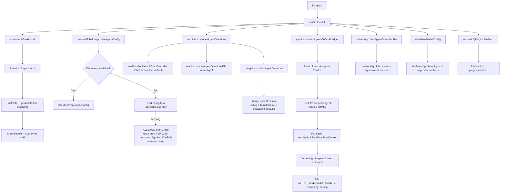
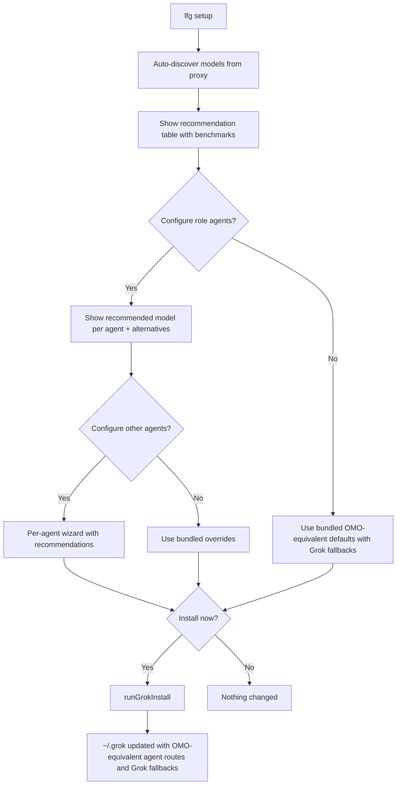

# LFG Agent Structure — EDM (Entity-Relationship Diagram)

## Overview

LFG manages agents across two systems: **Codex** (`~/.codex/agents/`) and **Grok** (`~/.grok/agents/`). The sync pipeline copies + transforms Codex agent TOMLs into Grok-compatible role TOMLs, applying deterministic OMO-equivalent model routing with Grok-compatible fallbacks.

Defaults may prefer the best discovered OMO-equivalent GPT/Gemini/Claude/GLM model for a role, while preserving explicit Grok fallbacks so the installed Grok surface remains usable when those primaries are unavailable.

---

## Entity Relationship Diagram

```mermaid
erDiagram
    CODEX_AGENTS ||--o{ GROK_AGENTS : "sync-lazycodex-agents-to-grok"
    OMO_BUNDLED_OVERRIDES ||--o{ OVERRIDE_MAP : "bundled OMO-equivalent defaults"
    GROK_CONFIG_TOML ||--o{ OVERRIDE_MAP : "lazycodex.agents.*"
    USER_OVERRIDES_FILE ||--o{ OVERRIDE_MAP : "user file wins"
    FLAVOUR_PACK ||--o{ GROK_AGENTS : "artistry + visual agents"
    DISCOVERY ||--o{ OVERRIDE_MAP : "role config from model discovery"
    MODEL_RECOMMENDATIONS ||--o{ INTERACTIVE_SETUP : "recommended models per agent"
    PERF_SNAPSHOT ||--o{ MODEL_RECOMMENDATIONS : "benchmark data"

    CODEX_AGENTS {
        string path "~/.codex/agents/*.toml"
        string format "Codex TOML (name, model, model_reasoning_effort, developer_instructions)"
    }

    GROK_AGENTS {
        string path "~/.grok/agents/*.toml"
        string format "Grok role TOML (description, model, reasoning_effort, prompt_file)"
        string prompts "~/.grok/prompts/omo/*.md"
    }

    OMO_BUNDLED_OVERRIDES {
        string path "flavour/omo-agent-overrides.json"
        string source "OMO-equivalent primaries with Grok fallback rationale"
    }

    USER_OVERRIDES_FILE {
        string path "~/.grok/lazycodex-agent-overrides.json"
        string version "1"
    }

    GROK_CONFIG_TOML {
        string path "~/.grok/config.toml"
        string section "lazycodex.agents.{explorer,reasoning,coding}"
    }

    FLAVOUR_PACK {
        string path "flavour/agent-configs/*.toml"
        string scope "artistry, visual, artistry-gen, artistry-qa"
    }

    MODEL_RECOMMENDATIONS {
        string source "model-recommendations.ts"
        string data "ROLE_RECOMMENDATIONS + PERF_SNAPSHOT"
    }

    PERF_SNAPSHOT {
        string source "Live proxy benchmark"
        string fields "latencyMs, tokensPerSec, codingQuality, reasoningQuality"
    }

    OVERRIDE_MAP {
        string resolution "user file > role discovery config > bundled OMO-equivalent defaults"
    }
```



---

## Model Performance (Live Benchmark via 127.0.0.1:8317)

### Coding Task Performance

| Model | Latency | t/s | Quality | Notes |
|-------|---------|-----|---------|-------|
| grok-4.20-0309-non-reasoning | **0.68s** | 63 | 2/2 | Fastest overall |
| grok-3-mini-fast | 1.96s | **147** | 2/2 | Best throughput |
| gpt-5.3-codex-spark | 2.10s | 219 | 2/2 | Benchmark only; not recommended for OMO agent roles |
| grok-3-mini | 3.36s | 147 | 2/2 | Balanced |
| codex-auto-review | 3.40s | 13 | 2/2 | Reliable |
| gpt-5.5 | 3.47s | 13 | 2/2 | Compact output |
| grok-build-0.1 | 3.72s | **150** | 2/2 | Build-optimized |
| grok-4.20-0309-reasoning | 4.42s | **175** | 2/2 | Reasoning-capable |
| gpt-5.4-mini | 5.54s | 21 | 2/2 | Slow but reliable |
| grok-4.20-multi-agent-0309 | 7.01s | **611** | 2/2 | Highest throughput |
| grok-4.3 | 8.48s | 160 | 2/2 | Frontier depth |

### Reasoning Task Performance

| Model | Latency | t/s | Quality | Notes |
|-------|---------|-----|---------|-------|
| grok-4.20-0309-non-reasoning | **1.96s** | 93 | 2/2 | Fast analysis |
| gpt-5.3-codex-spark | 2.06s | 370 | 2/2 | Benchmark only; not recommended for OMO agent roles |
| grok-4.3 | 4.26s | 155 | 2/2 | Deep reasoning |
| grok-4.20-0309-reasoning | 6.30s | **163** | 2/2 | Structured output |
| grok-4.20-multi-agent-0309 | 6.58s | **544** | 2/2 | Multi-agent |
| gpt-5.5 | 7.79s | 23 | 2/2 | Compact |
| grok-build-0.1 | 11.47s | 117 | 2/2 | Verbose |
| claude-opus-4-6-thinking | 18.29s | 34 | 2/2 | Slowest |

### Unsuitable Models (avoid for agent roles)

| Model | Issue |
|-------|-------|
| gemini-3-pro-high | Quality 0/2 (vision-only, no code) |
| glm-5.2 | Quality 0/2, slow (14.87s) |
| glm-5-turbo | Quality 0/2, slow (13.43s) |
| gpt-5.3-codex | HTTP 402 (payment required) |

---

## Agent Inventory (Grok-compatible fallbacks)

### Core OMO/Ultrawork Agents

| Agent | Grok Fallback | Latency | Effort | Role | Primary/Alt Models |
|-------|-----------------|---------|--------|------|-----------|
| explorer | `grok-3-mini-fast` | 1.96s | low | Codebase search | grok-3-mini, gpt-5.4-mini |
| librarian | `grok-3-mini` | 3.36s | low | External research | grok-3-mini-fast, gpt-5.4-mini |
| plan | `grok-4.20-0309-reasoning` | 6.30s | xhigh | Strategic planner | grok-4.3, gpt-5.5, claude-opus-4-6-thinking |
| metis | `grok-4.20-0309-non-reasoning` | 1.96s | high | Pre-planning analyst | grok-3-mini-fast, gpt-5.5 |
| momus | `grok-4.20-0309-reasoning` | 6.30s | xhigh | Plan reviewer | grok-4.3, gpt-5.5 |
| codex-ultrawork-reviewer | `grok-4.3` | 8.48s | high | ULW verification | grok-4.20-0309-reasoning, gpt-5.5, claude-opus-4-6-thinking |
| reasoning (role) | `grok-4.20-0309-reasoning` | 6.30s | high | General reasoning | grok-4.3, gpt-5.5 |
| coding (role) | `grok-4.20-0309-non-reasoning` | 0.68s | medium | Coding | grok-build-0.1, glm-5-turbo, codex-auto-review |

### Flavour-Pack Agents (Vision/Multimodal — non-Grok by design)

| Agent | Model | Role | Notes |
|-------|-------|------|-------|
| artistry | `gemini-3.5-flash-low` | Art director | Vision-required |
| artistry-gen | `gemini-3.1-pro-preview` | Art production | Computer Use + vision |
| artistry-qa | `gemini-3.1-pro-preview` | Art QA | Vision verification |
| visual-engineering | `gemini-3.1-pro-preview` | Vision specialist | Visual QA |
| multimodal-looker | `gemini-3.1-pro-preview` | Vision evidence | Raw evidence extraction |

---

## GPT-to-Grok Equivalent Mapping

| Codex Default (GPT) | Grok Equivalent | Speedup |
|---------------------|----------------|---------|
| gpt-5.4-mini (explorer) | grok-3-mini-fast | 2.8x faster |
| gpt-5.5 (plan/momus) | grok-4.20-0309-reasoning | Similar latency, 7x throughput |
| gpt-5.5 (reviewer) | grok-4.3 | Deeper analysis fallback |
| custom-metis-model (metis) | grok-4.20-0309-non-reasoning | 3.8x faster |
| gpt-5.5 (reasoning) | grok-4.20-0309-reasoning | Similar quality, 12x throughput |

---

## Sync Pipeline (Flow Diagram)



---

## Interactive Setup Flow



---

## Root Cause Analysis: Why Grok "Stopped Working" After LFG Install

### Primary Symptom
After `lfg setup --run`, Grok Build could not use lazycodex/omo agents properly. Agents appeared, but hooks were broken (duplicated bridge wrappers) and model assignments were wrong or used unknown models (`glm-5.2` etc.).

### Two Independent Failure Modes Discovered

#### 1. Hook Duplication (the "Grok won't run" part)
- **Source of truth**: live `~/.grok/installed-plugins/lfg/hooks/hooks.json` contained many entries like:
  ```
  node "bridge" node "bridge" node "bridge" node "real-component" ...
  ```
- **Root cause in code**: `wrapLazyCodexHookCommand` in `normalize-plugin-hooks.ts` was **not idempotent**.
  - It blindly prepended the bridge every time `normalizePluginHooksJson` / `mergePortedHooksIntoPlugin` ran.
  - Repair path (`runInternalGrokInstall` when stamp exists) and initial install both call the same merge.
  - Multiple runs, or repair after first install, accumulated wrappers.
- **Effect**: Grok executed the hook command line, which tried to spawn `node bridge node bridge node real...`. The inner spawns either failed to locate the real CLI or passed mangled arguments, so rules/telemetry/ultrawork/lsp/etc. hooks never ran. This made the whole lazycodex integration appear "dead" even when models and agents were present.
- **Fix**:
  - Made `wrapLazyCodexHookCommand` peel any number of outer bridge layers until it reaches a non-bridge target, then apply **exactly one** clean wrapper.
  - Added unit tests for double/triple-wrapped cases.
  - Re-normalized the live hooks.json with the idempotent logic.
  - Live result: 16 component commands, exactly 16 bridge markers, zero multi-wrapped.

#### 2. Model Assignment Mismatch (the "unknown models" part)
- Bundled `omo-agent-overrides.json` had Codex-era defaults (`grok-4.20-0309-non-reasoning` for explorer, `gpt-5.4-mini` for librarian) plus no entries for plan/metis/momus.
- Discovery + interactive wizard + user overrides file on disk ended up writing `glm-5.2` (and other non-Grok models) for planning agents.
- Codex originals used `gpt-5.5`/legacy Codex-family models; Grok proxy exposed some of them, but Codex Spark is not recommended for OMO agent roles and they were not the optimal or native Grok models.
- Result: agents existed in `~/.grok/agents/*.toml`, but the models were either slow, low-quality, or unfamiliar.
- **Fix**:
  - Rewrote `omo-agent-overrides.json` to OMO-equivalent primaries with Grok fallbacks based on live proxy benchmarking (see tables above).
  - Updated `FALLBACK_GLOBAL_LAZYCODEX_AGENTS`.
  - Added `model-recommendations.ts` + recommendation table in interactive `lfg setup`.
  - Forced live `~/.grok/agents/*.toml` + overrides + `config.toml` sections to deterministic role routes with explicit Grok fallbacks.
  - Also fixed flavour-pack agents (artistry, visual-*) to be synced into `~/.grok/agents/`.

### Why the Combination Felt Like "Grok is Broken"
- Duplicated hooks → no rules, no ultrawork loop, no LSP checks, no telemetry → the "lazy codex experience" disappeared.
- Bad models → even when an agent was invoked, it either used a slow/unknown model or fell back in ways the user didn't control.
- Both problems were created or amplified by the LFG install/repair flow.

### Current Live State (after fixes, before Grok restart)
- `~/.grok/installed-plugins/lfg/hooks/hooks.json`: clean, single bridge per component hook, Grok event map, all expected events present.
- Core agents (`explorer`, `plan`, `coding`, `reasoning`, `librarian`, `metis`, `momus`, `codex-ultrawork-reviewer`): use deterministic role routes with correct reasoning effort and explicit Grok-compatible fallbacks.
- `omo-agent-overrides.json`: OMO-equivalent primaries with Grok fallbacks.
- `config.toml` lazycodex agent sections: consistent with above.
- `lfg-install.json` stamp present; plugin dir is real (not symlink).
- Flavour-pack vision agents also present in `~/.grok/agents/`.

### What User Should Do Now
1. Fully quit/restart Grok Build (so it reloads the plugin hooks from the real directory and re-reads `~/.grok/agents` + `config.toml`).
2. Open a new session.
3. Optionally run `lfg doctor` or just start using; the first SessionStart + UserPromptSubmit should fire the cleaned hooks.
4. If you still see odd behavior, share the exact error or the output of the hook status lines that appear in the UI.
