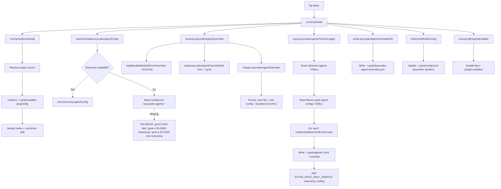
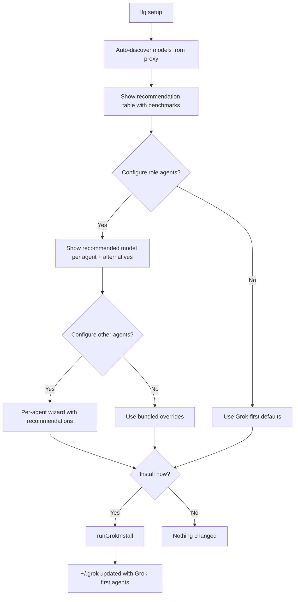

# LFG Agent Structure — EDM (Entity-Relationship Diagram)

## Overview

LFG manages agents across two systems: **Codex** (`~/.codex/agents/`) and **Grok** (`~/.grok/agents/`). The sync pipeline copies + transforms Codex agent TOMLs into Grok-compatible role TOMLs, applying Grok-first model overrides.

All defaults are **Grok-first**: every role prefers the best-performing Grok model, with GPT/Gemini/Cloude equivalents shown as alternatives.

---

## Entity Relationship Diagram

```mermaid
erDiagram
    CODEX_AGENTS ||--o{ GROK_AGENTS : "sync-lazycodex-agents-to-grok"
    OMO_BUNDLED_OVERRIDES ||--o{ OVERRIDE_MAP : "bundled Grok-first defaults"
    GROK_CONFIG_TOML ||--o{ OVERRIDE_MAP : "lazycodex.agents.*"
    USER_OVERRIDES_FILE ||--o{ OVERRIDE_MAP : "user file wins"
    FLAVOUR_PACK ||--o{ GROK_AGENTS : "artistry + visual agents"
    DISCOVERY ||--o{ OVERRIDE_MAP : "role config from model discovery"
    MODEL_RECOMMENDATIONS ||--o{ INTERACTIVE_SETUP : "recommended models per agent"
    PERF_SNAPSHOT ||--o{ MODEL_RECOMMENDATIONS : "benchmark data"

    CODEX_AGENTS {
        string path "~/.codex/agents/*.toml"
        string format "Codex TOML (name, model, model_reasoning_effort, developer_instructions)"
    }

    GROK_AGENTS {
        string path "~/.grok/agents/*.toml"
        string format "Grok role TOML (description, model, reasoning_effort, prompt_file)"
        string prompts "~/.grok/prompts/lazycodex/*.md"
    }

    OMO_BUNDLED_OVERRIDES {
        string path "flavour-pack-assets/omo-agent-overrides.json"
        string source "Grok-first defaults with perf rationale"
    }

    USER_OVERRIDES_FILE {
        string path "~/.grok/lazycodex-agent-overrides.json"
        string version "1"
    }

    GROK_CONFIG_TOML {
        string path "~/.grok/config.toml"
        string section "lazycodex.agents.{explorer,reasoning,coding}"
    }

    FLAVOUR_PACK {
        string path "flavour-pack-assets/agent-configs/*.toml"
        string scope "artistry, visual, artistry-gen, artistry-qa"
    }

    MODEL_RECOMMENDATIONS {
        string source "model-recommendations.ts"
        string data "ROLE_RECOMMENDATIONS + PERF_SNAPSHOT"
    }

    PERF_SNAPSHOT {
        string source "Live proxy benchmark"
        string fields "latencyMs, tokensPerSec, codingQuality, reasoningQuality"
    }

    OVERRIDE_MAP {
        string resolution "user file > role discovery config > bundled Grok-first defaults"
    }
```

---

## Model Performance (Live Benchmark via 127.0.0.1:8317)

### Coding Task Performance

| Model | Latency | t/s | Quality | Notes |
|-------|---------|-----|---------|-------|
| grok-4.20-0309-non-reasoning | **0.68s** | 63 | 2/2 | Fastest overall |
| grok-3-mini-fast | 1.96s | **147** | 2/2 | Best throughput |
| gpt-5.3-codex-spark | 2.10s | **219** | 2/2 | Highest t/s |
| grok-3-mini | 3.36s | 147 | 2/2 | Balanced |
| codex-auto-review | 3.40s | 13 | 2/2 | Reliable |
| gpt-5.5 | 3.47s | 13 | 2/2 | Compact output |
| grok-build-0.1 | 3.72s | **150** | 2/2 | Build-optimized |
| grok-4.20-0309-reasoning | 4.42s | **175** | 2/2 | Reasoning-capable |
| gpt-5.4-mini | 5.54s | 21 | 2/2 | Slow but reliable |
| grok-4.20-multi-agent-0309 | 7.01s | **611** | 2/2 | Highest throughput |
| grok-4.3 | 8.48s | 160 | 2/2 | Frontier depth |

### Reasoning Task Performance

| Model | Latency | t/s | Quality | Notes |
|-------|---------|-----|---------|-------|
| grok-4.20-0309-non-reasoning | **1.96s** | 93 | 2/2 | Fast analysis |
| gpt-5.3-codex-spark | 2.06s | **370** | 2/2 | High throughput |
| grok-4.3 | 4.26s | 155 | 2/2 | Deep reasoning |
| grok-4.20-0309-reasoning | 6.30s | **163** | 2/2 | Structured output |
| grok-4.20-multi-agent-0309 | 6.58s | **544** | 2/2 | Multi-agent |
| gpt-5.5 | 7.79s | 23 | 2/2 | Compact |
| grok-build-0.1 | 11.47s | 117 | 2/2 | Verbose |
| claude-opus-4-6-thinking | 18.29s | 34 | 2/2 | Slowest |

### Unsuitable Models (avoid for agent roles)

| Model | Issue |
|-------|-------|
| gemini-3-pro-high | Quality 0/2 (vision-only, no code) |
| glm-5.1 | Quality 0/2, slow (14.87s) |
| glm-5-turbo | Quality 0/2, slow (13.43s) |
| gpt-5.3-codex | HTTP 402 (payment required) |

---

## Agent Inventory (Grok-first)

### Core OMO/Ultrawork Agents

| Agent | Grok Recommended | Latency | Effort | Role | Alt Models |
|-------|-----------------|---------|--------|------|-----------|
| explorer | `grok-3-mini-fast` | 1.96s | low | Codebase search | grok-3-mini, gpt-5.4-mini |
| librarian | `grok-3-mini` | 3.36s | low | External research | grok-3-mini-fast, gpt-5.4-mini |
| plan | `grok-4.20-0309-reasoning` | 6.30s | xhigh | Strategic planner | grok-4.3, gpt-5.5, claude-opus-4-6-thinking |
| metis | `grok-4.20-0309-non-reasoning` | 1.96s | high | Pre-planning analyst | grok-3-mini-fast, gpt-5.5 |
| momus | `grok-4.20-0309-reasoning` | 6.30s | xhigh | Plan reviewer | grok-4.3, gpt-5.5 |
| codex-ultrawork-reviewer | `grok-4.3` | 8.48s | high | ULW verification | grok-4.20-0309-reasoning, gpt-5.3-codex-spark, claude-opus-4-6-thinking |
| reasoning (role) | `grok-4.20-0309-reasoning` | 6.30s | high | General reasoning | grok-4.3, gpt-5.5 |
| coding (role) | `grok-4.20-0309-non-reasoning` | 0.68s | medium | Coding | grok-build-0.1, gpt-5.3-codex-spark, codex-auto-review |

### Flavour-Pack Agents (Vision/Multimodal — non-Grok by design)

| Agent | Model | Role | Notes |
|-------|-------|------|-------|
| artistry | `gemini-3.5-flash-low` | Art director | Vision-required |
| artistry-gen | `gemini-3.1-pro-preview` | Art production | Computer Use + vision |
| artistry-qa | `gemini-3.1-pro-preview` | Art QA | Vision verification |
| visual-engineering | `gemini-3.1-pro-preview` | Vision specialist | Visual QA |
| visual-looker | `gemini-3.1-pro-preview` | Vision evidence | Raw evidence extraction |

---

## GPT-to-Grok Equivalent Mapping

| Codex Default (GPT) | Grok Equivalent | Speedup |
|---------------------|----------------|---------|
| gpt-5.4-mini (explorer) | grok-3-mini-fast | 2.8x faster |
| gpt-5.5 (plan/momus) | grok-4.20-0309-reasoning | Similar latency, 7x throughput |
| gpt-5.3-codex-spark (reviewer) | grok-4.3 | Deeper analysis, slower |
| custom-metis-model (metis) | grok-4.20-0309-non-reasoning | 3.8x faster |
| gpt-5.5 (reasoning) | grok-4.20-0309-reasoning | Similar quality, 12x throughput |

---

## Sync Pipeline (Flow Diagram)

---

## Interactive Setup Flow

