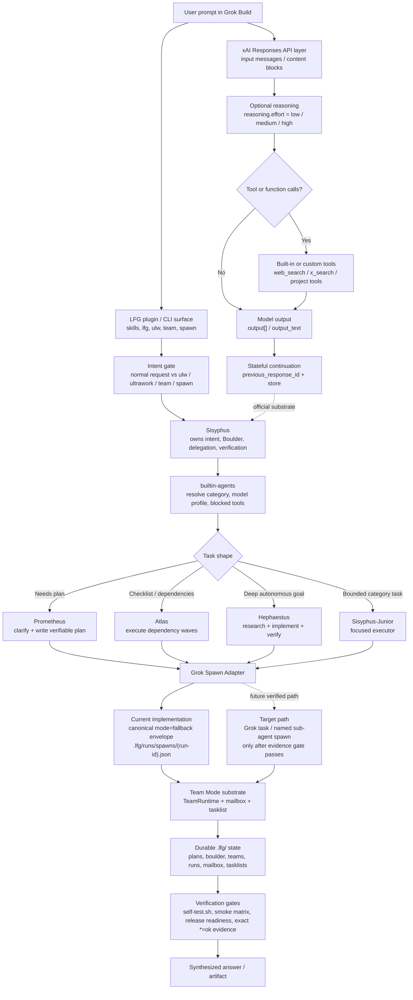

# Grok Build Prompt Stages — How LFG Responds

This page is the visual `@docs/` map for how `lfg` behaves when a user prompt enters Grok Build. It separates the official xAI Responses API layer from LFG's project-specific OMO orchestration layer.

For the lower-level implementation details, see `ARCHITECTURE.md`. For platform claims, treat `reference.md` as the source of truth.

## Current Status Summary

- Official xAI / Responses API concepts: `input`, optional reasoning effort, tool/function calling, `previous_response_id`, `store`, and typed `output` / `output_text`.
- LFG project concepts: Sisyphus intent ownership, Prometheus planning, Atlas checklist waves, Hephaestus deep work, Sisyphus-Junior category execution, Team Mode, Boulder state, and evidence gates.
- Current spawn reality: `spawn_agent()` resolves OMO agents to Grok model profiles and persists a canonical provider-neutral envelope with `mode=fallback` and normalized `status`. Plugin-context named sub-agent spawning is still an evidence-gated target, not a completed runtime claim.

## Picture: Prompt Lifecycle Across Layers

## Stage Table

| Stage | Official xAI / Grok substrate | LFG behavior in this project | Current evidence boundary |
| --- | --- | --- | --- |
| 1. Prompt input | Responses API `input` receives role/content items. | User prompt reaches a plugin, CLI, skill, `lfg`, `ulw`, `team`, or `spawn` surface. | `reference.md`, `HOW-IT-WORKS.md` |
| 2. Intent detection | Official docs do not define LFG-style intent stages. | LFG detects `ulw` / ultrawork / team / spawn paths and treats Sisyphus as the intent owner. | `plugins/lfg/bin/lfg.py`, `src/agents/sisyphus.json` |
| 3. Model and policy resolution | xAI models support reasoning effort; Responses API exposes reasoning options. | `builtin-agents` and `resolve_omo_model_profile()` force first-class agents to `xai/grok-4.3` with category-specific reasoning. | `ARCHITECTURE.md`, `src/agents/builtin-agents.json` |
| 4. Planning | Official layer has no Prometheus concept. | Prometheus handles non-trivial planning and produces verifiable plans before execution. | `src/agents/prometheus.json`, `agent-system/` docs |
| 5. Delegation / execution | Responses API supports tool/function calling and stateful continuation. Local Grok evidence also documents task-style sub-agents, but plugin-context native spawning remains unverified. | Atlas, Hephaestus, and Sisyphus-Junior represent dependency waves, deep work, and bounded execution. `spawn_agent()` currently returns `fallback_manual_gate` and records evidence. | `ARCHITECTURE.md`, `evidence/grok-subagent-spawning.md`, `evidence/m1-grok-spawning-evidence-plan.md` |
| 6. Coordination state | `previous_response_id` and `store` provide official stateful continuation primitives. | Team Mode persists mailbox, tasklist, plans, runs, Boulder pointers, and spawn envelopes under `.lfg/`. | `HOW-IT-WORKS.md`, `ARCHITECTURE.md` |
| 7. Verification and answer | Responses API returns typed output / `output_text`. | LFG requires evidence strings, smoke gates, release-readiness checks, and synthesized final output. | `SMOKE.md`, `TEST_RULES.md`, `RELEASE_CHECKLIST.md` |

## Important Boundaries

- Do not describe Sisyphus, Prometheus, Atlas, Hephaestus, or Sisyphus-Junior as official xAI platform stages. They are LFG's OMO parity layer.
- Do not claim plugin-context named Grok sub-agent spawning is complete until the manual gate in `evidence/grok-subagent-spawning.md` is replaced by recorded evidence.
- MCP is not required for this diagram. The lookup path is `docs/docs-index.json` → this file → related implementation or evidence docs.

## Fast Lookup Path for Agents

When an agent is asked `@docs/ how does the prompt flow work?`:

1. Read `docs/docs-index.json` first.
2. Resolve this page by keywords: `prompt-stages`, `grok-build`, `responses-api`, `sisyphus`, `spawn-adapter`, `verification`.
3. Read `GROK-BUILD-PROMPT-STAGES.md`.
4. If implementation proof is needed, then read `ARCHITECTURE.md` and the spawn evidence docs.

**Last updated**: May 2026.
